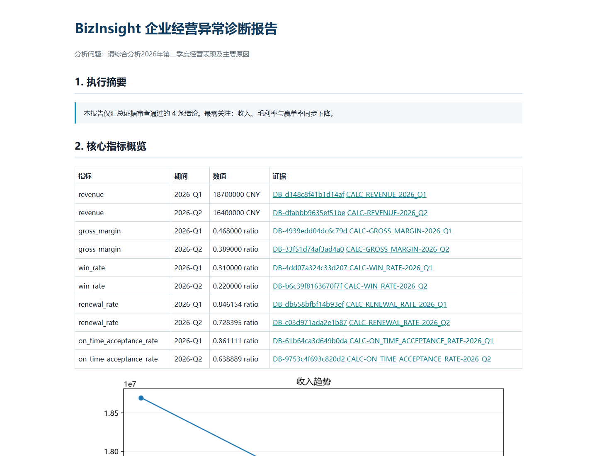

# BizInsight Agent 1.0

BizInsight Agent 是一个基于 **AgentScope 2.0.7** 的 ToB 企业经营异常诊断 MVP。用户提出经营问题后，Leader 会规划并路由任务，财务销售、客户产品、项目交付和外部研究 Worker 并行取证，Reviewer 复算关键指标并控制因果边界，最后生成含五张趋势图和证据索引的 Markdown/HTML 管理报告。

项目参考 AgentScope 官方案例 Alias 的 Planner–Worker–Toolkit 职责设计，但没有复制旧版 API 或应用代码。固定参考版本为 `agentscope-samples@c7f3174cbbd32a96c796571d0fe930ac80ddd523`；迁移边界见 [Alias 归因](references/alias-attribution.md) 和 [兼容性审计](docs/alias-compatibility-audit.md)。

> 所有公司、客户和经营数据均为程序生成的虚构数据；项目未在任何真实企业生产环境部署。

## 1.0 能力

- AgentScope `Agent`、`Toolkit`、`FunctionTool`、结构化输出和 `CustomEvent` 的真实集成。
- 通用 AgentScope Supervisor：普通对话直接回答，专业问题调用内部 RAG，经营问题进入完整多 Agent 链路，实时天气通过独立 Weather MCP 查询。
- Leader–Worker 并行协作；专项问题按需路由，综合问题最多四个任务。
- SQLite 只读查询、数据集白名单、确定性指标计算和可追溯 Evidence。
- 动态季度解析与数据库范围校验，支持区域、行业、客户规模、产品版本细分。
- Business Data MCP：每个 Worker 通过独立 AgentScope `MCPClient` 获得五类只读工具，进程级 scope 防越权。
- 内部 RAG：中文 n-gram + Okapi BM25；可显式构建 Qwen `text-embedding-v4`、AgentScope `KnowledgeBase` 与本地 Qdrant，并用 RRF 融合。
- Tavily 缺失或失败时明确降级；离线模式即使 `.env` 有 Key 也绝不联网。
- Reviewer 先做确定性复算/证据/冲突/因果硬审查，再做可选模型语义审查，并最多定向返工一次。
- 十一节报告、五张本地图表、CLI、AgentScope Agent Service 接口和 15 条自动评测。
- 每次运行生成安全 run ID、事件、Agent 耗时/token 和错误 telemetry，不序列化密钥。



## 快速开始

要求 Python 3.11～3.13。PowerShell：

```powershell
python -m venv .venv
.\.venv\Scripts\Activate.ps1
python -m pip install -e ".[dev,service,research]"
python scripts/generate_data.py
python scripts/build_knowledge_base.py
python -m bizinsight.cli --mode offline --question "分析公司2026年第二季度经营表现下降的主要原因" --output-dir outputs/demo
```

打开 `outputs/demo/report.html` 查看离线报告。默认测试和离线 CLI 不访问网络、不会产生模型费用。

在网页端接入前，可以直接用交互式 CLI 验证通用 Supervisor：

```powershell
python -m bizinsight.supervisor_cli
```

它保留当前会话的短期上下文。例如先问“今天天气怎么样”，再回答“上海”；也可以询问“你是谁”、内部专业知识或要求生成经营分析报告。实时天气使用无需额外密钥的 Open-Meteo Weather MCP。

## 在线模式

复制 `.env.example` 为 `.env`，显式配置 `DASHSCOPE_API_KEY`、`BIZINSIGHT_MODEL_NAME` 和可选的 `TAVILY_API_KEY`，然后运行：

```powershell
python -m bizinsight.cli --mode online --question "请综合分析2026年第二季度经营表现及主要原因"
```

在线模式使用百炼模型构建真实 AgentScope Leader、四类 Worker 和 Reviewer；Tavily 缺失时外部研究仍可降级，百炼配置缺失则立即报错。

`.env.example` 只能保留空占位符；真实 Key 仅写入被 Git 忽略的 `.env`。如 Key 曾出现在聊天、提交或日志中，应先吊销再生成。

构建向量索引必须显式确认一次付费 embedding 操作：

```powershell
python scripts/build_knowledge_base.py --online-embedding
python evaluations/run_rag_evaluation.py --mode hybrid
```

不带 `--online-embedding` 时只构建零网络 BM25 索引。

## Agent Service 与 Web UI

```powershell
python -m pip install -e ".[service]"
.\scripts\start_webui.ps1
```

`start_webui.ps1` 会启动本项目 FastAPI 服务并打开 `http://127.0.0.1:8000/`。如需在前台查看服务日志，可改为先运行 `.\scripts\start_backend.ps1`，再访问该地址。

网页端和 CLI 共用同一个 Supervisor：输入普通问题会直接显示回答；专业知识问题调用内部 RAG；实时天气调用 Weather MCP；经营诊断问题进入现有 Leader–Worker–Reviewer 链路，并在页面右侧显示审核后的 HTML 报告。普通问答不会生成或伪造报告。

知识库页面位于 `http://127.0.0.1:8000/knowledge`，只读展示当前 RAG 索引中的真实文档，并支持按名称或类型搜索和分页查看。

服务默认使用本地 SQLite，启动不需要 Redis；只有显式设置 `BIZINSIGHT_SERVICE_STORAGE=redis` 时才连接 Redis。网页使用 `POST /bizinsight/chat`，AgentScope 标准 HTTP 会话接口仍可使用。Supervisor 再按意图选择通用回答、Hybrid RAG、Weather MCP 或现有 `run_analysis` 经营链路。

BizInsight 扩展端点为 `GET /bizinsight/health`、`POST /bizinsight/chat` 和 `POST /bizinsight/analyze`，报告通过受控 `/bizinsight/reports` 静态路径打开。分析事件和 telemetry 分别写入 `*.events.json` 与 `*.telemetry.json`。

## 测试与评测

```powershell
pytest
python evaluations/run_evaluation.py --mode offline
python evaluations/run_rag_evaluation.py --mode offline
```

当前固定种子离线基线：15 个用例平均 **99.93/100**；BM25 RAG 基线 Hit@3 与 MRR 均为 **1.0**。真实模型稳定性必须用重新生成的本地 Key 显式运行 `python evaluations/run_online_stability.py --runs 5`，不能用离线结果冒充。

## 文档

- [架构与数据流](docs/architecture.md)
- [合成数据说明](docs/dataset.md)
- [评测方法与结果](docs/evaluation.md)
- [6～8 分钟演示脚本](docs/demo-script.md)
- [实施复盘](docs/retrospective.md)
- [面试准备](docs/interview-notes.md)
- [设计规格](docs/2026-09-08-bizinsight-agent-design.md)
- [实施计划](docs/2026-09-08-bizinsight-agent-implementation-plan.md)

## 许可证

本项目采用 Apache License 2.0。上游来源和原创范围记录于 [references/alias-attribution.md](references/alias-attribution.md)。
