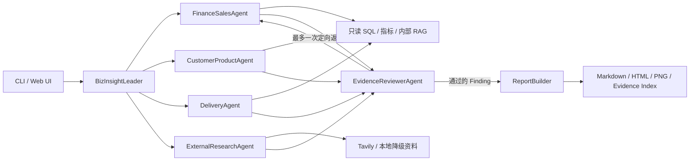

# 架构与数据流

## 为什么使用 AgentScope

本项目需要的不是单次问答，而是“规划—分工—工具取证—审查—交付”的有状态协作。AgentScope 2.0.7 提供 Agent、类型化工具、结构化输出、事件和 Agent Service，使模型推理与确定性业务计算可以分层治理。

## 与 Alias 的关系

Alias 使用旧版 AgentScope。BizInsight 只借鉴其 Meta Planner、领域 Worker 和 Toolkit 分层思想，基于 2.0.7 公共 API 重写。核心原创包括业务数据模型、领域权限、证据契约、确定性指标、Reviewer、报告和评测。这保留了官方案例的成熟职责划分，又避免维护脆弱的旧 API 兼容层。

## 两种执行路径

离线路径以确定性 Worker 替代模型判断，但仍运行同一 `AnalysisPlan`、异步调度、Finding、Reviewer、报告和 `CustomEvent` 契约，用于 CI 和稳定演示。在线路径显式创建六类 AgentScope Agent，模型通过 `ChatModelBase` 注入，只有用户选择 `--mode online` 时才调用百炼。

## 安全边界

- SQL 只允许单条 `SELECT`/只读 `WITH`，SQLite authorizer 再做一层写操作拦截。
- 每个 Worker 只能访问职责范围内的数据集和指标。
- 模型不能自行给出关键指标最终值，Reviewer 会从数据库重新计算。
- WEB/DOC/CALC/DB 证据类型分开；外部信息不能单独证明内部因果。
- 报告只能写入调用方指定目录，图表文件名经过白名单校验。
- 密钥只从环境读取，健康检查只返回“是否配置”。
