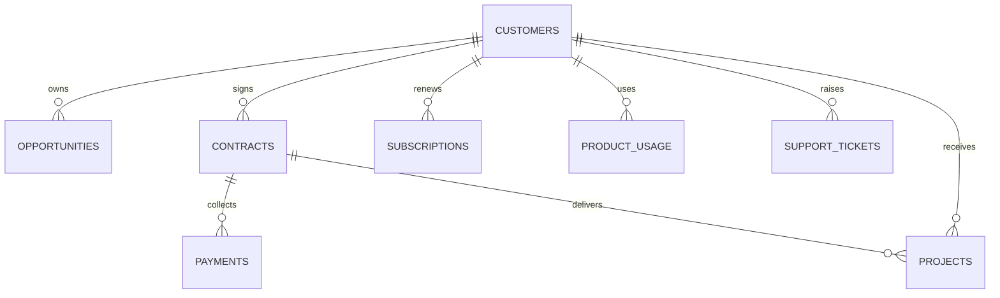

# 合成数据说明

数据描述的是完全虚构的 B2B 科技企业“云衡数科有限公司”。生成器使用固定种子 `20260908`，每次生成相同的 CSV、SQLite 和黄金真值，便于复现测试。

| 表 | 行数 | 主要用途 |
|---|---:|---|
| customers | 240 | 区域、规模、行业分群 |
| opportunities | 800 | 赢单率、输单原因 |
| contracts | 350 | 收入、成本、毛利 |
| subscriptions | 2500 | 到期与续费 |
| product_usage | 2880 | 版本和使用活跃度 |
| projects | 120 | 验收、工时、定制程度 |
| support_tickets | 1800 | 故障与服务压力 |
| payments | 600 | 回款情况 |

黄金季度从 2026-Q1 到 Q2 的核心变化为：收入 1870 万降至 1640 万、毛利率 46.8% 降至 38.9%、续费率 84.6154% 降至 72.8395%、赢单率 31% 降至 22%、按时验收率 86.1111% 降至 63.8889%。

运行时只读取 `data/` 下的业务表、字典和文档；`evaluations/ground_truth/` 仅供评分器和测试使用，Agent 工作流不读取黄金答案。
